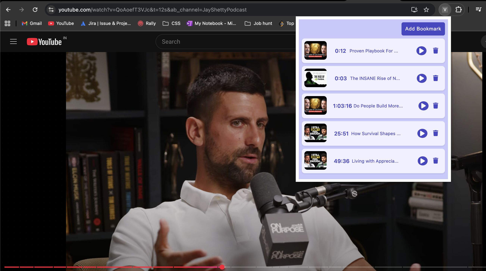

# video-bookmarker

A Chrome Extension built to bookmark timestamps from youtube videos. This makes it easy to save and revisit key moments in any video.

### Installation

- Clone this repo `git clone https://github.com/KavyaMVG/video-bookmark`
- Open chrome browser > Extensions > Manage Extensions > Load unpacked
- Select the cloned project

### Usage

- Go to [youtube](https://youtube.com) and open any video of choice
- Click on the video bookmarker extension and click on add bookmark to video mark a video at current time

### Learnings

- Learnt about background scripts, content scripts, and popup scripts and establish connection between all these.
- Using chrome runtime and chrome.storage for communication and persistence.
- Manipulating the Dom of third-party websites (injecting elements like video titles into popup)

### Screenshot

## Author

